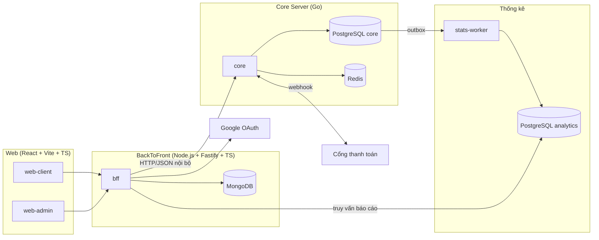

# Kiến trúc

## Tổng quan

## Các tầng

| Tầng | Thành phần | Vai trò |
|---|---|---|
| **Web** | `web-client`, `web-admin` | Giao diện SPA (build tĩnh, phục vụ qua CDN). Chỉ gọi BFF. |
| **BackToFront** | `bff` | Xác thực Google, quản lý session, phân quyền admin, gom/định dạng dữ liệu cho UI, rate limit, cache. Lưu dữ liệu mềm (profile, session, preference, audit log) trong MongoDB. |
| **Core** | `core` | **Nguồn sự thật** cho tồn kho ghế, đơn hàng, vé, ví. Mọi logic ảnh hưởng tính đúng đắn nằm ở đây. |
| **Thống kê** | `stats-worker` | Tiêu thụ sự kiện từ outbox của core, ghi vào PostgreSQL analytics dạng fact/aggregate. |

## Nguyên tắc thiết kế

1. **Core là modular monolith** — một service, chia module theo nghiệp vụ với ranh giới chặt. Xem [ADR-0001](adr/0001-modular-monolith-core.md).
2. **Một nguồn sự thật cho tiền và ghế** — chỉ `core` được ghi vào dữ liệu ghế, đơn hàng, ledger. BFF không bao giờ tự tính tiền.
3. **Web không gọi thẳng core** — core không public ra internet; BFF là cổng duy nhất.
4. **Tách OLTP / OLAP** — báo cáo đọc từ analytics DB, không đọc từ core DB.
5. **Idempotent mọi nơi** — mọi lệnh ghi có tác động tiền/ghế đều mang idempotency key.
6. **Sự kiện qua outbox** — ghi sự kiện cùng transaction với dữ liệu nghiệp vụ, không publish trực tiếp.

## Công nghệ

| Thành phần | Stack |
|---|---|
| Web | React, Vite, TypeScript, React Router, shadcn/ui (Tailwind CSS), TanStack Query, React Hook Form + Zod |
| BackToFront | Node.js, Fastify, TypeScript, MongoDB, @fastify/oauth2 (Google), undici, Zod |
| Core | Go, PostgreSQL, pgx, sqlc, goose, chi |
| Thống kê | Go (worker), PostgreSQL (partitioning, materialized view) |
| Cache / lock | Redis |
| Build | Bazel + Gazelle (Go, `com/tm/server`), pnpm workspace (TS, `com/tm/app`) |
| Hạ tầng | Docker Compose, k6, OpenTelemetry, Prometheus, Grafana |

## Yêu cầu phi chức năng

| Chỉ số | Mục tiêu |
|---|---|
| Thông lượng tìm chuyến | ≥ 5.000 req/s |
| Thông lượng đặt vé (cao điểm) | ≥ 1.000 booking/s |
| Latency p99 đặt vé | < 300 ms |
| Latency p99 tìm chuyến | < 150 ms |
| Bán trùng ghế | **0** |
| Sai lệch tiền | **0 đồng** |
| Độ trễ dữ liệu thống kê | < 5 phút |
| Availability | 99,9% |

## Observability

- **Tracing**: OpenTelemetry, trace ID truyền từ BFF sang core qua header `traceparent`.
- **Metrics**: Prometheus — RED metrics cho mỗi endpoint, số ghế đang hold, độ trễ outbox, pool connection PG.
- **Logging**: JSON có cấu trúc, luôn kèm `trace_id`, `user_id`, `request_id`.
- **Dashboard**: Grafana (datasource Prometheus + Tempo provision sẵn). Dashboard **snaptix — RED** provision từ `deploy/observability/grafana/provisioning/dashboards/json/`.
- **Hợp đồng metric HTTP**: mọi service phát OTel `http.server.request.duration` (histogram, giây) với `http.response.status_code`, `http.route` → Prometheus `http_server_request_duration_seconds_*{service_name, ...}`.
- **Luồng local**: app → OTLP (4317/4318) → otel-collector → Tempo (trace) / Prometheus (metric) → Grafana. Cấu hình trong `deploy/observability/`.
