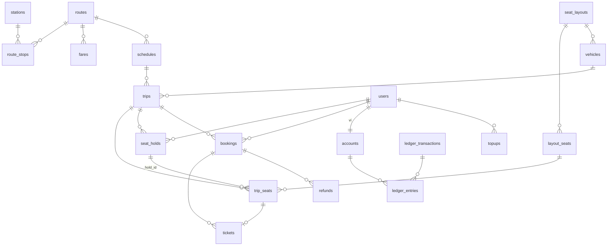

# Database

| Database | Chủ sở hữu | Dữ liệu |
|---|---|---|
| **PostgreSQL core** | `core` | Catalog, lịch chạy, giá, ghế, đơn hàng, vé, ví, ledger, outbox |
| **MongoDB** | `bff` | Profile người dùng, session, tài khoản admin, audit log, preference |
| **PostgreSQL analytics** | `stats-worker` (ghi), `bff` (đọc) | Fact, dimension, aggregate phục vụ báo cáo |

Mỗi database chỉ có **một** service được ghi.

---

## PostgreSQL core

### ERD

### Catalog

**`stations`**
| Cột | Kiểu | Ghi chú |
|---|---|---|
| id | uuid PK | |
| code | text UNIQUE | Mã trạm |
| name | text | |
| type | text | `BUS_STATION` \| `TRAIN_STATION` |
| address | text | |
| lat, lng | numeric(9,6) | |
| is_active | boolean | |

**`routes`**
| Cột | Kiểu | Ghi chú |
|---|---|---|
| id | uuid PK | |
| code | text UNIQUE | |
| name | text | |
| vehicle_type | text | `BUS` \| `TRAIN` |
| is_active | boolean | |

**`route_stops`**
| Cột | Kiểu | Ghi chú |
|---|---|---|
| route_id | uuid FK | PK (route_id, stop_order) |
| stop_order | smallint | |
| station_id | uuid FK | |
| offset_minutes | int | Phút từ trạm đầu |

**`seat_layouts`** — id, name, vehicle_type, floors, rows, cols, version, created_at

**`layout_seats`**
| Cột | Kiểu | Ghi chú |
|---|---|---|
| id | uuid PK | |
| layout_id | uuid FK | |
| seat_code | text | `A05`, UNIQUE (layout_id, seat_code) |
| floor, row, col | smallint | |
| seat_class | text | `STANDARD` \| `VIP` \| `SLEEPER_LOWER` \| ... |

**`vehicles`** — id, code UNIQUE, vehicle_type, layout_id FK, status (`ACTIVE` \| `MAINTENANCE`)

### Lịch chạy & giá

**`fares`**
| Cột | Kiểu | Ghi chú |
|---|---|---|
| id | uuid PK | |
| route_id | uuid FK | |
| from_stop, to_stop | smallint | Đoạn áp dụng |
| seat_class | text | |
| amount | bigint | VND, `CHECK (amount > 0)` |
| valid_from, valid_to | timestamptz | Lịch sử giá; không ghi đè |

**`schedules`** — id, route_id, vehicle_id, departure_time (time), recurrence (jsonb), start_date, end_date, sale_open_days

**`trips`**
| Cột | Kiểu | Ghi chú |
|---|---|---|
| id | uuid PK | |
| schedule_id | uuid FK NULL | |
| route_id | uuid FK | |
| vehicle_id | uuid FK | |
| departure_at | timestamptz | INDEX (route_id, departure_at) |
| sale_open_at | timestamptz | |
| status | text | `SCHEDULED` \| `ON_SALE` \| `PAUSED` \| `DEPARTED` \| `CANCELLED` |
| total_seats, available_seats | int | Đếm denormalized cho trang tìm kiếm |
| version | int | Optimistic lock |

**`trip_seats`** — tồn kho ghế, bảng nóng nhất hệ thống
| Cột | Kiểu | Ghi chú |
|---|---|---|
| trip_id | uuid | PK (trip_id, seat_id) |
| seat_id | uuid FK layout_seats | |
| seat_code | text | |
| seat_class | text | |
| status | text | `AVAILABLE` \| `HELD` \| `SOLD` \| `BLOCKED` |
| hold_id | uuid NULL | |
| booking_id | uuid NULL | |
| updated_at | timestamptz | |

Partition theo `HASH (trip_id)` hoặc `RANGE` theo tháng khởi hành khi dữ liệu lớn.

### Đặt vé

**`seat_holds`**
| Cột | Kiểu | Ghi chú |
|---|---|---|
| id | uuid PK | |
| user_id | uuid FK | |
| trip_id | uuid FK | |
| status | text | `ACTIVE` \| `CONVERTED` \| `RELEASED` \| `EXPIRED` |
| expires_at | timestamptz | INDEX partial `WHERE status = 'ACTIVE'` |
| created_at | timestamptz | |

**`bookings`**
| Cột | Kiểu | Ghi chú |
|---|---|---|
| id | uuid PK | |
| code | text UNIQUE | Mã đơn hiển thị |
| user_id | uuid FK | INDEX (user_id, created_at DESC) |
| trip_id | uuid FK | |
| hold_id | uuid UNIQUE | Một hold chỉ thành một booking |
| total_amount | bigint | |
| status | text | `CONFIRMED` \| `PARTIALLY_CANCELLED` \| `CANCELLED` |
| ledger_tx_id | uuid FK | |
| created_at | timestamptz | |

**`tickets`**
| Cột | Kiểu | Ghi chú |
|---|---|---|
| id | uuid PK | |
| booking_id | uuid FK | |
| trip_id, seat_id | uuid | **UNIQUE (trip_id, seat_id) WHERE status <> 'CANCELLED'** — chốt chặn cuối chống bán trùng |
| passenger_name, passenger_phone | text | |
| price | bigint | Giá chốt lúc bán |
| status | text | `ISSUED` \| `USED` \| `CANCELLED` |
| qr_token | text UNIQUE | |

**`refunds`** — id, booking_id, ticket_id NULL, amount, reason, type (`POLICY` \| `MANUAL` \| `TRIP_CANCELLED`), ledger_tx_id, created_by, created_at

### Ví (double-entry ledger)

**`accounts`**
| Cột | Kiểu | Ghi chú |
|---|---|---|
| id | uuid PK | |
| owner_type | text | `USER` \| `SYSTEM` |
| owner_id | uuid NULL | user_id với ví người dùng |
| code | text UNIQUE | Với tài khoản hệ thống: `CASH_IN`, `REVENUE`, `REFUND_EXPENSE` |
| balance | bigint | Snapshot, cập nhật cùng transaction ghi entry |
| version | bigint | |
| CHECK | | `owner_type <> 'USER' OR balance >= 0` |

**`ledger_transactions`** — id, type (`TOPUP` \| `PAYMENT` \| `REFUND` \| `ADJUSTMENT`), reference_type, reference_id, idempotency_key UNIQUE, created_at

**`ledger_entries`**
| Cột | Kiểu | Ghi chú |
|---|---|---|
| id | bigserial PK | |
| tx_id | uuid FK | |
| account_id | uuid FK | INDEX (account_id, id DESC) |
| amount | bigint | Dương = có (credit), âm = nợ (debit) |
| balance_after | bigint | |
| created_at | timestamptz | Partition RANGE theo tháng |

Bất biến: `SUM(amount) = 0` cho mỗi `tx_id`; entry không bao giờ bị UPDATE/DELETE.

**`topups`** — id, user_id, amount, provider, provider_ref UNIQUE, status (`PENDING` \| `SUCCEEDED` \| `FAILED` \| `EXPIRED`), ledger_tx_id, created_at, updated_at

### Hạ tầng

**`users`** — id (trùng id ở MongoDB), email, status, created_at

**`idempotency_keys`**
| Cột | Kiểu | Ghi chú |
|---|---|---|
| key | uuid | PK (user_id, key) |
| user_id | uuid | |
| request_hash | text | Phát hiện reuse key với body khác |
| response_status | int | |
| response_body | jsonb | Trả lại y hệt khi retry |
| created_at | timestamptz | Dọn sau 24h |

**`outbox_events`**
| Cột | Kiểu | Ghi chú |
|---|---|---|
| id | uuid PK | |
| aggregate_type, aggregate_id | text | |
| event_type | text | |
| payload | jsonb | |
| created_at | timestamptz | |
| published_at | timestamptz NULL | INDEX partial `WHERE published_at IS NULL` |

---

## MongoDB (BFF)

| Collection | Nội dung | Index |
|---|---|---|
| `users` | `_id`, `google_sub`, `email`, `name`, `avatar`, `phone`, `preferences`, `status`, `created_at` | `google_sub` unique, `email` unique |
| `sessions` | `_id` (session id), `user_id`, `roles`, `csrf_token`, `expires_at`, `ip`, `user_agent` | TTL `expires_at`, `user_id` |
| `admin_accounts` | `user_id`, `roles[]`, `granted_by`, `granted_at` | `user_id` unique |
| `audit_logs` | `actor_id`, `action`, `resource`, `resource_id`, `before`, `after`, `ip`, `at` | (`resource`, `resource_id`), `at` |
| `saved_passengers` | Hành khách hay dùng của người dùng | `user_id` |

---

## PostgreSQL analytics

Mô hình star schema, dữ liệu chỉ thêm (append-only) từ sự kiện.

### Dimension
| Bảng | Cột chính |
|---|---|
| `dim_date` | date_key, date, day_of_week, is_weekend, is_holiday, month, quarter, year |
| `dim_route` | route_id, code, name, vehicle_type, from_station, to_station |
| `dim_trip` | trip_id, route_id, departure_at, total_seats |

### Fact
| Bảng | Grain | Cột chính |
|---|---|---|
| `fact_bookings` | 1 dòng / vé | event_id UNIQUE, booking_id, ticket_id, trip_id, route_id, user_id, seat_class, price, booked_at, departure_at, lead_time_hours, status |
| `fact_cancellations` | 1 dòng / vé huỷ | event_id UNIQUE, ticket_id, refund_amount, cancelled_at |
| `fact_topups` | 1 dòng / lệnh nạp | event_id UNIQUE, topup_id, user_id, amount, provider, succeeded_at |

Các bảng fact partition RANGE theo tháng, dùng BRIN index trên cột thời gian.

### Aggregate
| Bảng / view | Nội dung | Làm mới |
|---|---|---|
| `agg_revenue_hourly` | Doanh thu, số vé theo giờ × tuyến × hạng ghế | Upsert bởi stats-worker |
| `agg_revenue_daily` | Rollup từ hourly | Job mỗi giờ |
| `agg_trip_occupancy` | Ghế bán / tổng ghế theo chuyến | Upsert theo sự kiện |
| `mv_top_routes_30d` | Top tuyến 30 ngày | `REFRESH MATERIALIZED VIEW CONCURRENTLY` mỗi 15 phút |

### `processed_events`
`event_id` PK — đảm bảo stats-worker xử lý mỗi sự kiện đúng một lần.
