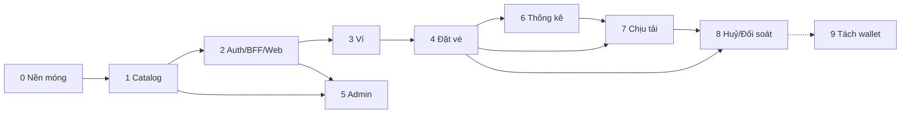

# Planning

## Phase và workstream

| | Phase | Workstream |
|---|---|---|
| Trục | **Thời gian** — làm lần lượt | **Chuyên môn** — chạy xuyên suốt |
| Trả lời câu hỏi | "Bao giờ xong cái gì?" | "Mảng nào, ai phụ trách?" |
| Kết thúc | Có mốc rõ ràng, demo được | Không kết thúc, sống cùng dự án |
| Ví dụ | Phase 3 — Ví | `core`, `db`, `bff`, `web` |

snaptix dùng **phase làm trục chính** (làm một mình nên cần mốc tuần tự rõ ràng), **workstream làm tag** cho từng task để biết task thuộc mảng nào và theo dõi tiến bộ theo công nghệ.

### Workstream

| Tag | Mảng | Công nghệ |
|---|---|---|
| `infra` | Monorepo, Bazel, Docker, CI, observability | Bazel, Docker, GitHub Actions, OTel, Prometheus, Grafana |
| `core` | Core service | Go |
| `db` | Schema, migration, truy vấn, tuning | PostgreSQL |
| `bff` | BackToFront | Node.js, Fastify, MongoDB |
| `web` | Web client | React, Vite |
| `admin` | Web admin | React, Vite |
| `analytics` | Stats worker, analytics DB | Go, PostgreSQL |
| `qa` | Test tự động, load test | testcontainers, Vitest, Playwright, k6 |

## Tổng quan phase

| Phase | Tên | Mốc demo | Trạng thái |
|---|---|---|---|
| [0](phase-0-foundation/) | Nền móng | `docker compose up` chạy đủ hạ tầng, CI xanh, trace hiển thị trên Grafana | 🟨 |
| [1](phase-1-catalog-search/) | Catalog & tìm chuyến | Gọi API core tìm được chuyến từ dữ liệu seed | ⬜ |
| [2](phase-2-auth-bff-web/) | Đăng nhập, BFF, web client | Đăng nhập Google, tìm chuyến trên web | ⬜ |
| [3](phase-3-wallet/) | Ví | Nạp tiền, xem số dư và lịch sử giao dịch | ⬜ |
| [4](phase-4-booking/) | Giữ chỗ & đặt vé | Chọn ghế realtime, đặt vé bằng ví, nhận vé QR | ⬜ |
| [5](phase-5-admin/) | Admin | Admin tạo tuyến, lịch chạy, giá; quản lý đơn | ⬜ |
| [6](phase-6-analytics/) | Thống kê | Dashboard doanh thu, lấp đầy gần realtime | ⬜ |
| [7](phase-7-scale/) | Chịu tải & tối ưu | Đạt chỉ tiêu phi chức năng dưới k6 | ⬜ |
| [8](phase-8-cancel-reconcile/) | Huỷ/hoàn vé, đối soát, hardening | Huỷ vé hoàn tiền, đối soát chênh lệch 0, E2E đầy đủ | ⬜ |
| [9](phase-9-split-wallet/) | *(Tuỳ chọn)* Tách wallet thành service riêng | Saga core ↔ wallet; bảng so sánh với monolith | ⬜ |

Trạng thái: ⬜ chưa bắt đầu · 🟨 đang làm · ✅ xong



## Cấu trúc mỗi phase

```
phase-N-<tên>/
├── README.md            # mục tiêu, phạm vi, requirement, task, challenge, DoD, checklist đóng phase
├── acceptance-tests.md  # test nghiệm thu phase (P<N>-ATnn), dùng cho DoD
├── tasks/
│   └── <Task ID>/
│       └── test-cases.md  # bộ test case riêng của task (<Task ID>-TCnn), tạo ở bước 1
└── lessons-learned.md   # viết SAU khi đóng phase
```

| Mục | Ý nghĩa |
|---|---|
| **Requirement** | Hệ thống phải làm được gì — chức năng (FR) và phi chức năng (NFR). Có ID để test nghiệm thu tham chiếu. |
| **Task** | Việc cụ thể cần làm, dạng checklist, gắn tag workstream và ID challenge liên quan. |
| **Challenge** | Thử thách kỹ thuật cần giải quyết trong phase, kèm tiêu chí "hoàn thành khi". |
| **DoD** (Definition of Done) | Điều kiện để coi **phase** là xong. Khác với task: DoD là tiêu chí nghiệm thu, task là việc làm. |
| **Checklist đóng phase** | Việc hành chính bắt buộc trước khi chuyển phase: docs, ADR, lessons learned. |
| **Test case theo task** | Bộ test case riêng của từng task trong `tasks/<Task ID>/test-cases.md`, ID `<Task ID>-TCnn` (vd `P0-T01-TC01`), viết ở bước 1 và phải được duyệt trước khi code. |
| **Test nghiệm thu** | Test cấp phase trong `acceptance-tests.md`, ID `P<N>-ATnn`, kiểm chứng requirement và challenge; dùng cho DoD. |
| **Lessons learned** | Bài học cấp phase do người dùng viết: kiến thức mới, sai lầm, số liệu, điều sẽ làm khác. Ghi chú kỹ thuật cấp task nằm ở [handbook](../handbook/README.md). |

## Quy trình làm một phase

> Quy trình chi tiết cho từng task (validate → test case + duyệt → code → unit test → build & test → test case + handbook → commit) nằm trong [`CLAUDE.md`](../../../../../CLAUDE.md) ở root repo.

1. Đọc lại README phase, chỉnh requirement/task nếu cần.
2. Làm từng task theo thứ tự, mỗi task đi đủ checklist con 6 bước và được commit trước khi sang task sau.
3. Challenge có nhiều phương án → viết ADR trong [`../adr/`](../adr/).
4. Đủ DoD → chạy checklist đóng phase.
5. Người dùng viết `lessons-learned.md`, cập nhật trạng thái ở bảng trên.

## Chỉ mục challenge

Mỗi challenge được giao cho **một** phase chính.

| Công nghệ | Challenge → Phase |
|---|---|
| Golang | G1→4 · G2→1 · G3→0 · G4→4 · G5→3 · G6→3 · G7→1 · G8→7 · G9→3 · G10→0 · G11→1 · G12→1 · G13→7 · G14→0 |
| PostgreSQL core | P1→4 · P2→4 · P3→4 · P4→3 · P5→3 · P6→3 · P7→1 · P8→6 · P9→7 · P10→8 · P11→7 · P12→7 |
| PostgreSQL analytics | A1→6 · A2→6 · A3→6 · A4→6 · A5→6 · A6→6 |
| Node.js | N1→7 · N2→2 · N3→2 · N4→5 · N5→7 · N6→4 · N7→7 · N8→2 · N9→7 |
| MongoDB | M1→2 · M2→2 · M3→2 · M4→5 |
| React | R1→4 · R2→4 · R3→4 · R4→5 · R5→5 · R6→6 · R7→8 · R8→8 · R9→4 · R10→2 · R11→2 |
| Redis | D1→7 · D2→7 · D3→7 |
| Microservice | S1→9 · S2→9 · S3→9 · S4→9 |

## Mục tiêu học tập

| Công nghệ | Kỹ năng hướng tới ở level Senior |
|---|---|
| **Golang** | Hexagonal architecture, concurrency (goroutine, channel, context, errgroup), graceful shutdown, profiling với pprof, testing (table-driven, testcontainers) |
| **PostgreSQL** | Transaction & isolation, locking, index & query plan, partitioning, replication, tuning, thiết kế schema cho tiền và tồn kho |
| **Node.js** | Event loop, streaming, xử lý lỗi, BFF pattern với Fastify (plugin, hook, schema), caching, rate limiting, bảo mật (OAuth, CSRF, session) |
| **React** | Quản lý state, server state (TanStack Query), tối ưu render, form phức tạp, realtime UI (sơ đồ ghế), code splitting, accessibility |

> Next.js tạm gác lại, sẽ học ở dự án khác.
