# Planning

## Phase và workstream

| | Phase | Workstream |
|---|---|---|
| Trục | **Thời gian** — làm lần lượt | **Chuyên môn** — chạy xuyên suốt |
| Trả lời câu hỏi | "Bao giờ xong cái gì?" | "Mảng nào, ai phụ trách?" |
| Kết thúc | Có mốc rõ ràng, demo được | Không kết thúc, sống cùng dự án |
| Ví dụ | Phase 3 — Ví | `core`, `db`, `bff`, `web` |

snaptix dùng **phase làm trục chính** (làm một mình nên cần mốc tuần tự rõ ràng), **workstream làm tag** cho từng task để biết task thuộc mảng nào và theo dõi tiến bộ theo công nghệ.

### Workstream

| Tag | Mảng | Công nghệ |
|---|---|---|
| `infra` | Monorepo, Bazel, Docker, CI, observability | Bazel, Docker, GitHub Actions, OTel, Prometheus, Grafana |
| `core` | Core service | Go |
| `db` | Schema, migration, truy vấn, tuning | PostgreSQL |
| `bff` | BackToFront | Node.js, Fastify, MongoDB |
| `web` | Web client | React, Vite |
| `admin` | Web admin | React, Vite |
| `analytics` | Stats worker, analytics DB | Go, PostgreSQL |
| `qa` | Test tự động, load test | testcontainers, Vitest, Playwright, k6 |

## Chặng học theo công nghệ

Mỗi chặng chỉ tập trung **một nhóm công nghệ** để làm đến đâu hiểu đến đó. Chặng A làm toàn bộ core (Go + PG) và kiểm bằng `curl` / `go test`; chặng B bọc API core bằng BFF (Node + Mongo); chặng C làm giao diện React; chặng D tổng hợp.

| Chặng | Công nghệ | Phase |
|---|---|---|
| A | Go + PostgreSQL | 1 → 6 |
| B | Node.js + MongoDB | 7 → 8 |
| C | React | 9 → 10 |
| D | Tổng hợp | 11 → 13 |

## Tổng quan phase

| Phase | Chặng · Công nghệ | Tên | Mốc demo | Trạng thái |
|---|---|---|---|---|
| [0](phase-0-foundation/) | Go + PG | Nền móng (tối giản) | `make up && make migrate`, core `/readyz` 200, CI xanh | ⬜ |
| [1](phase-1-catalog-search/) | A · Go + PostgreSQL | Catalog & tìm chuyến | `curl` API core tìm được chuyến trên 10 triệu `trip_seats`, p99 < 20ms | ⬜ |
| [2](phase-2-wallet/) | A · Go + PostgreSQL | Ví (core) | `curl` nạp tiền qua mock provider, số dư và lịch sử đúng; retry không ghi trùng | ⬜ |
| [3](phase-3-booking/) | A · Go + PostgreSQL | Giữ chỗ & đặt vé (core) | k6 tranh ghế: 0 vé trùng; đặt vé bằng `curl` trừ ví đúng | ⬜ |
| [4](phase-4-cancel-reconcile/) | A · Go + PostgreSQL | Huỷ/hoàn vé & đối soát (core) | `curl` huỷ vé → tiền hoàn đúng chính sách; job đối soát báo chênh lệch 0 | ⬜ |
| [5](phase-5-admin-api/) | A · Go + PostgreSQL | Admin API (core) | `curl` tạo tuyến → lịch chạy → slot sinh ra và tìm được | ⬜ |
| [6](phase-6-analytics/) | A · Go + PostgreSQL | Thống kê (Go + PG analytics) | Đặt vé → aggregate trong PG analytics cập nhật < 5 phút; replay không lệch số | ⬜ |
| [7](phase-7-bff-foundation/) | B · Node.js + MongoDB | BFF nền tảng & đăng nhập | Đăng nhập Google, `curl` tìm chuyến qua BFF; một trace đi bff → core → PG | ⬜ |
| [8](phase-8-bff-business/) | B · Node.js + MongoDB | BFF nghiệp vụ & admin | Toàn bộ API public và admin dùng được bằng `curl`; SSE sơ đồ ghế realtime | ⬜ |
| [9](phase-9-web-client/) | C · React + TypeScript | Web client (React) | Người dùng đăng nhập, tìm chuyến, chọn ghế realtime, nạp tiền, đặt vé, huỷ vé trên web | ⬜ |
| [10](phase-10-web-admin/) | C · React + TypeScript | Web admin (React) | Operator setup tuyến → slot trên web admin; dashboard thống kê | ⬜ |
| [11](phase-11-scale/) | D · Go + PG + Node + Redis | Chịu tải & tối ưu | k6 'mở bán Tết' 30 phút đạt chỉ tiêu; tắt Redis giữa chừng vẫn đúng | ⬜ |
| [12](phase-12-e2e-hardening/) | D · Toàn hệ thống | E2E & hardening | E2E luồng chính chạy xanh trong CI < 10 phút | ⬜ |
| [13](phase-13-split-wallet/) | D · Go + PG + gRPC | *(Tuỳ chọn)* Tách wallet thành service riêng | Saga core ↔ wallet; bảng so sánh với monolith | ⬜ |

Trạng thái: ⬜ chưa bắt đầu · 🟨 đang làm · ✅ xong

```mermaid
flowchart LR
    P0[0 Nền móng] --> P1[1 Catalog] --> P2[2 Ví] --> P3[3 Đặt vé] --> P4[4 Huỷ/đối soát] --> P5[5 Admin API] --> P6[6 Thống kê]
    P6 --> P7[7 BFF nền tảng] --> P8[8 BFF nghiệp vụ]
    P8 --> P9[9 Web client] --> P10[10 Web admin]
    P10 --> P11[11 Chịu tải] --> P12[12 E2E]
    P12 -.-> P13[13 Tách wallet]
```



## Cấu trúc mỗi phase

```
phase-N-<tên>/
├── README.md            # mục tiêu, phạm vi, requirement, task, challenge, DoD, checklist đóng phase
├── acceptance-tests.md  # test nghiệm thu phase (P<N>-ATnn), dùng cho DoD
├── tasks/
│   └── <Task ID>/
│       └── test-cases.md  # bộ test case riêng của task (<Task ID>-TCnn), tạo ở bước 1
└── lessons-learned.md   # viết SAU khi đóng phase
```

| Mục | Ý nghĩa |
|---|---|
| **Requirement** | Hệ thống phải làm được gì — chức năng (FR) và phi chức năng (NFR). Có ID để test nghiệm thu tham chiếu. |
| **Task** | Việc cụ thể cần làm, dạng checklist, gắn tag workstream và ID challenge liên quan. |
| **Challenge** | Thử thách kỹ thuật cần giải quyết trong phase, kèm tiêu chí "hoàn thành khi". |
| **DoD** (Definition of Done) | Điều kiện để coi **phase** là xong. Khác với task: DoD là tiêu chí nghiệm thu, task là việc làm. |
| **Checklist đóng phase** | Việc hành chính bắt buộc trước khi chuyển phase: docs, ADR, lessons learned. |
| **Test case theo task** | Bộ test case riêng của từng task trong `tasks/<Task ID>/test-cases.md`, ID `<Task ID>-TCnn` (vd `P0-T01-TC01`), viết ở bước 1 và phải được duyệt trước khi code. |
| **Test nghiệm thu** | Test cấp phase trong `acceptance-tests.md`, ID `P<N>-ATnn`, kiểm chứng requirement và challenge; dùng cho DoD. |
| **Lessons learned** | Bài học cấp phase do người dùng viết: kiến thức mới, sai lầm, số liệu, điều sẽ làm khác. Ghi chú kỹ thuật cấp task nằm ở [handbook](../handbook/README.md). |

## Quy trình làm một phase

> Quy trình chi tiết cho từng task (validate → test case + duyệt → code → unit test → build & test → test case + handbook → commit) nằm trong [`CLAUDE.md`](../../../../../CLAUDE.md) ở root repo.

1. Đọc lại README phase, chỉnh requirement/task nếu cần.
2. Làm từng task theo thứ tự, mỗi task đi đủ checklist con 6 bước và được commit trước khi sang task sau.
3. Challenge có nhiều phương án → viết ADR trong [`../adr/`](../adr/).
4. Đủ DoD → chạy checklist đóng phase.
5. Người dùng viết `lessons-learned.md`, cập nhật trạng thái ở bảng trên.

## Chỉ mục challenge

Mỗi challenge được giao cho **một** phase chính.

| Công nghệ | Challenge → Phase |
|---|---|
| Golang | G1→3 · G2→1 · G3→0 · G4→3 · G5→2 · G6→2 · G7→1 · G8→11 · G9→2 · G10→7 · G11→1 · G12→1 · G13→11 · G14→0 |
| PostgreSQL core | P1→3 · P2→3 · P3→3 · P4→2 · P5→2 · P6→2 · P7→1 · P8→6 · P9→11 · P10→4 · P11→11 · P12→11 |
| PostgreSQL analytics | A1→6 · A2→6 · A3→6 · A4→6 · A5→6 · A6→6 |
| Node.js | N1→11 · N2→7 · N3→7 · N4→8 · N5→11 · N6→8 · N7→11 · N8→7 · N9→11 |
| MongoDB | M1→7 · M2→7 · M3→7 · M4→8 |
| React | R1→9 · R2→9 · R3→9 · R4→10 · R5→10 · R6→10 · R7→9 · R8→9 · R9→9 · R10→9 · R11→9 |
| Redis | D1→11 · D2→11 · D3→11 |
| Microservice | S1→13 · S2→13 · S3→13 · S4→13 |

## Mục tiêu học tập

| Công nghệ | Kỹ năng hướng tới ở level Senior |
|---|---|
| **Golang** | Hexagonal architecture, concurrency (goroutine, channel, context, errgroup), graceful shutdown, profiling với pprof, testing (table-driven, testcontainers) |
| **PostgreSQL** | Transaction & isolation, locking, index & query plan, partitioning, replication, tuning, thiết kế schema cho tiền và tồn kho |
| **Node.js** | Event loop, streaming, xử lý lỗi, BFF pattern với Fastify (plugin, hook, schema), caching, rate limiting, bảo mật (OAuth, CSRF, session) |
| **React** | Quản lý state, server state (TanStack Query), tối ưu render, form phức tạp, realtime UI (sơ đồ ghế), code splitting, accessibility |

> Next.js tạm gác lại, sẽ học ở dự án khác.
