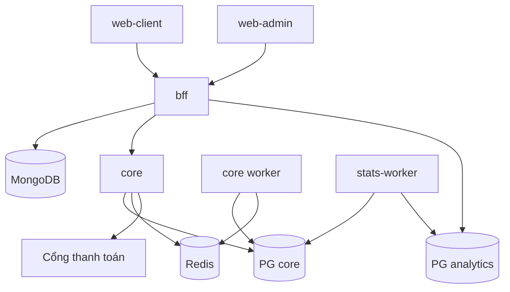

# Quan hệ service

## Sơ đồ phụ thuộc



## Trách nhiệm

| Service | Làm | Không làm |
|---|---|---|
| `web-client` / `web-admin` | Render UI, gọi BFF | Gọi core, giữ secret |
| `bff` | Auth Google, session, RBAC, rate limit, gom dữ liệu, cache đọc, audit log admin | Tính giá, đổi trạng thái ghế, ghi ledger |
| `core` (server) | Catalog, lịch chạy, giá, hold, booking, vé, ví, nạp tiền, hoàn tiền | Xác thực người dùng cuối (tin header từ BFF qua mTLS / service token) |
| `core` (worker) | Hết hạn hold, relay outbox, đối soát thanh toán, sinh slot theo lịch | — |
| `stats-worker` | Consume sự kiện, ghi fact, refresh aggregate | Ghi vào core DB |

## Giao tiếp

| Từ → Đến | Giao thức | Xác thực |
|---|---|---|
| Web → BFF | HTTPS JSON, cookie session | Session cookie (HttpOnly, SameSite=Lax) + CSRF token |
| BFF → Core | HTTP JSON nội bộ | Service token + header `X-User-Id`, `X-User-Role` |
| Cổng thanh toán → Core | Webhook HTTPS | Chữ ký HMAC |
| Core → stats-worker | Bảng `outbox_events` (polling `FOR UPDATE SKIP LOCKED`) | — |

## Đồng bộ người dùng

- Người dùng được tạo ở **BFF** (MongoDB) khi đăng nhập Google lần đầu.
- BFF gọi `POST /internal/v1/users` sang core (idempotent theo `user_id`) để core tạo bản ghi user tối thiểu và **ví**.
- Core chỉ lưu `user_id`, `email`, `status` — profile đầy đủ nằm ở MongoDB.

## Luồng nghiệp vụ chính

### Đặt vé

```mermaid
sequenceDiagram
    actor U as User
    participant W as web-client
    participant B as bff
    participant C as core
    participant P as PG core

    U->>W: Chọn ghế
    W->>B: POST /api/holds
    B->>C: POST /internal/v1/holds (Idempotency-Key)
    C->>P: BEGIN; khoá trip_seats; insert seat_holds; COMMIT
    C-->>B: hold_id, expires_at
    B-->>W: 201

    U->>W: Thanh toán
    W->>B: POST /api/bookings
    B->>C: POST /internal/v1/bookings (Idempotency-Key)
    C->>P: BEGIN
    C->>P: kiểm tra hold còn hạn & thuộc user
    C->>P: tính giá từ fares
    C->>P: ghi ledger (ví user → doanh thu chờ)
    C->>P: trip_seats = SOLD, tạo booking + tickets
    C->>P: insert outbox_events(booking.confirmed)
    C->>P: COMMIT
    C-->>B: booking + tickets
    B-->>W: 201
```

Mọi bước trong **một transaction PostgreSQL** — không cần saga phân tán vì ghế và ví cùng nằm trong core DB. Saga chỉ dùng khi thanh toán qua cổng bên ngoài.

### Nạp tiền

```mermaid
sequenceDiagram
    participant B as bff
    participant C as core
    participant G as Cổng thanh toán

    B->>C: POST /internal/v1/topups (Idempotency-Key)
    C->>C: tạo topup PENDING
    C-->>B: payment_url
    G->>C: webhook (đã ký)
    C->>C: BEGIN; topup SUCCEEDED; ghi ledger; outbox; COMMIT
    Note over C: Worker đối soát định kỳ các topup PENDING quá hạn
```

### Huỷ vé

1. BFF gọi `POST /internal/v1/bookings/{id}/cancel`.
2. Core tính số tiền hoàn theo chính sách, trong một transaction: ticket `CANCELLED`, `trip_seats` về `AVAILABLE`, ghi ledger hoàn tiền, outbox `booking.cancelled`.

## Sự kiện (outbox)

| Sự kiện | Phát khi | Consumer |
|---|---|---|
| `booking.confirmed` | Đặt vé thành công | stats-worker |
| `booking.cancelled` | Huỷ vé | stats-worker |
| `topup.succeeded` | Nạp tiền thành công | stats-worker |
| `refund.created` | Hoàn tiền | stats-worker |
| `trip.created` / `trip.cancelled` | Sinh / huỷ slot | stats-worker |

Envelope:

```json
{
  "id": "0192...",
  "type": "booking.confirmed",
  "aggregate_id": "booking-id",
  "occurred_at": "2026-09-26T10:00:00Z",
  "version": 1,
  "payload": { }
}
```

Consumer xử lý **at-least-once** và phải idempotent theo `id` sự kiện.
